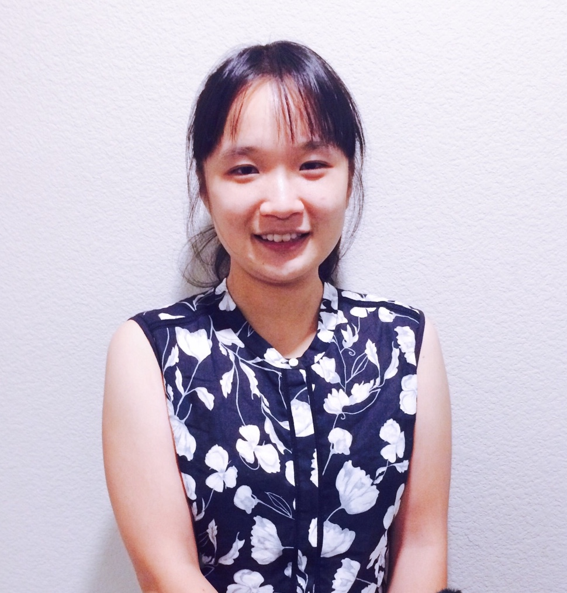

<h2> About me </h2>

 Hello! My name is Ruoxin Li, you can also call me Rita. I am a Ph.D candidate in Biostatistics at UC Davis. My current research focus is developing statistical methods to visualize single cell expression profiles, in order to better identify cellular trajectories. I am interested in the application of probabilistic models and machine learning methods in high-dimensional genomic data, especially in how model interpretation brings up meaningful biological insights. My work is under the supervision of <a href = "http://qlab.faculty.ucdavis.edu/"> Prof.Gerald Quon</a>

In my spare time, I enjoy hiking and hand-crafting. I am also trying to develop certain level of expertise in illustration.

